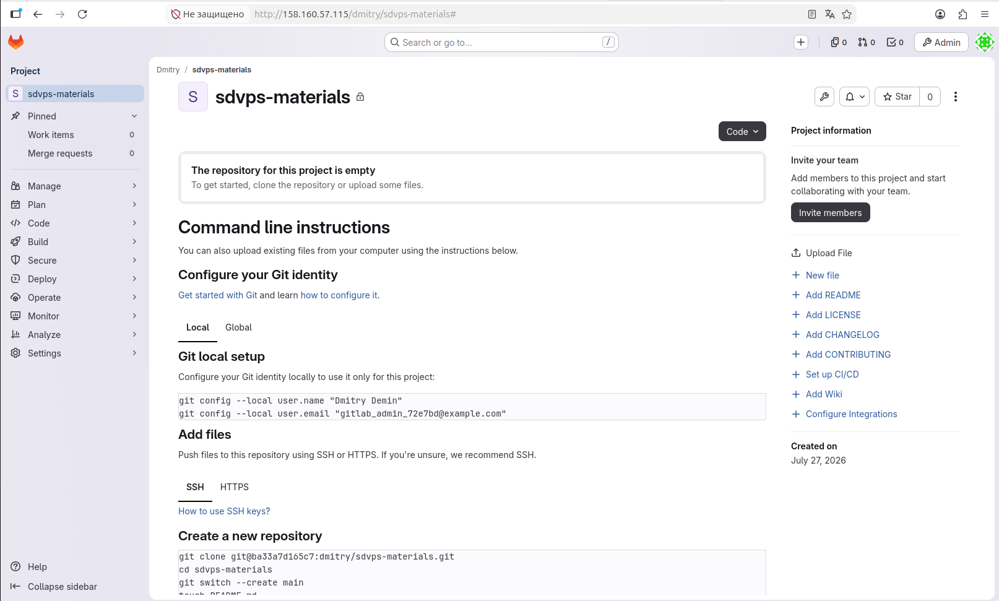
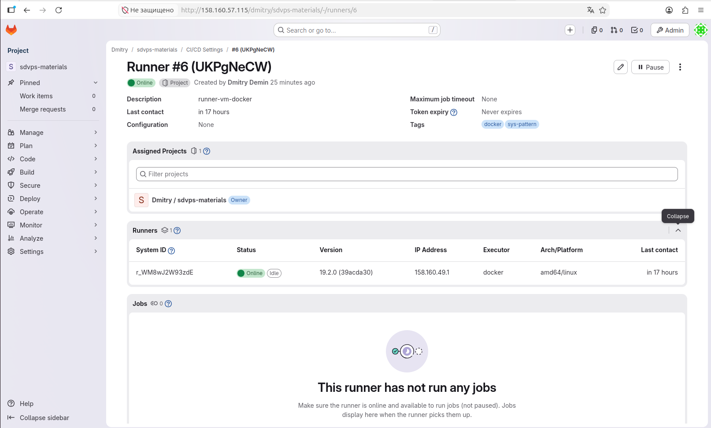
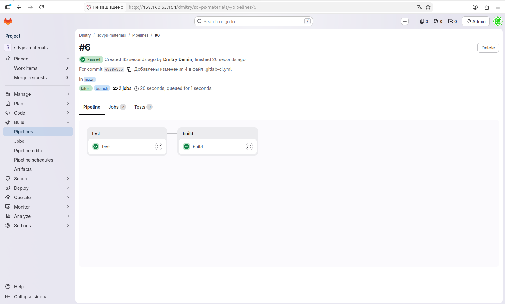

# Домашнее задание к занятию «GitLab» . Студент Демин Дмитрий Александрович.

## Задание 1

Что нужно сделать:

    1. Разверните GitLab локально, используя Vagrantfile и инструкцию, описанные в этом репозитории.
    2. Создайте новый проект и пустой репозиторий в нём.
    3. Зарегистрируйте gitlab-runner для этого проекта и запустите его в режиме Docker. Раннер можно регистрировать и запускать на той же виртуальной машине, на которой запущен GitLab.

В качестве ответа в репозиторий шаблона с решением добавьте скриншоты с настройками раннера в проекте.

## Решение

1. GitLab развернут локально на вм gitlab-ce IP 158.160.57.115 в docker контейнере . для этого использована роль Ansible.

``` yml
- name: Установить Docker
  apt:
    name: docker.io
    state: present
    update_cache: yes
  become: yes

- name: Убедиться, что Docker запущен
  service:
    name: docker
    state: started
    enabled: yes
  become: yes


- name: Создать базовую директорию для GitLab
  file:
    path: /srv/gitlab
    state: directory
    owner: root
    group: root
    mode: "0755"
  become: yes


- name: Создать директории для данных GitLab (config, data, logs)
  file:
    path: "/srv/gitlab/{{ item }}"
    state: directory
    owner: root
    group: root
    mode: "0750"
  loop:
    - config
    - data
    - logs
  become: yes

- name: Добавить пользователя dmitry в группу docker
  user:
    name: dmitry
    groups: docker
    append: yes
  become: yes

- name: Перезапустить Docker для применения прав группы
  service:
    name: docker
    state: restarted
  become: yes


- name: Удалить старый контейнер gitlab, если существует
  command: docker rm -f gitlab
  ignore_errors: yes
  become: yes

- name: Запустить GitLab в Docker
  command: >
    docker run -d
      --name gitlab
      --restart always
      -p 80:80 -p 443:443 -p 2222:22
      -v /srv/gitlab/config:/etc/gitlab:rw
      -v /srv/gitlab/logs:/var/log/gitlab:rw
      -v /srv/gitlab/data:/var/opt/gitlab:rw
      -e ALERTMANAGER_ENABLE_CLUSTER=false
      -e GITLAB_OMNIBUS_CONFIG="external_url=\"http://{{ ansible_host }}\""
      gitlab/gitlab-ce:latest
  become: yes
  register: gitlab_start

- name: Показать статус запуска GitLab
  debug:
    msg: "GitLab container started: {{ gitlab_start.stdout }}"
  when: gitlab_start is success

- name: Показать ошибку, если запуск не удался
  debug:
    msg: "Failed to start GitLab container: {{ gitlab_start.stderr }}"
  when: gitlab_start is failed
```
2. Создан пустой репозиторий



3. Зарегистрирован gitlab-runner для этого проекта и запущен в режиме Docker на вм gitlab-runner IP 158.160.49.1 , использована роль Ansible.

``` yml
---
- name: Установить Docker
  apt:
    name: docker.io
    state: present
    update_cache: yes
  become: yes

- name: Добавить пользователя dmitry в группу docker
  user:
    name: dmitry
    groups: docker
    append: yes
  become: yes

- name: Создать директорию для конфига GitLab Runner
  file:
    path: /srv/gitlab-runner/config
    state: directory
    owner: dmitry
    group: dmitry
    mode: "0755"
  become: yes

- name: Убедиться, что Docker запущен
  service:
    name: docker
    state: started
    enabled: yes
  become: yes

- name: Запустить GitLab Runner как Docker-контейнер
  command: >
    docker run -d
    --name gitlab-runner
    --restart always
    --network host
    -v /srv/gitlab-runner/config:/etc/gitlab-runner
    -v /var/run/docker.sock:/var/run/docker.sock
    gitlab/gitlab-runner:latest
  become: yes
  failed_when: false
  register: runner_start

- name: Показать статус запуска (если контейнер уже был)
  debug:
    msg: "gitlab-runner container already exists or started. Output: {{ runner_start.stderr }}"
  when: runner_start.rc != 0 and runner_start.stderr is search("already in use")
```
Регистрация

``` Text
dmitry@gitlab-runner:~$ docker exec -it gitlab-runner gitlab-runner register
Runtime platform                                    arch=amd64 os=linux pid=43 revision=39acda30 version=19.2.0
Running in system-mode.

Enter the GitLab instance URL (for example, https://gitlab.com/):
http://158.160.57.115/
Enter the registration token:
glrt-UKPgNeCW7PHzEL-5KE8Qv286MQpwOjEKdDozCnU6MQ8.01.1716xcl2e
Verifying runner... is valid                        correlation_id=01KYHXJW3H40R1JX2VMBCJN9Y4 runner=UKPgNeCW7 runner_name=gitlab-runner
Enter a name for the runner. This is stored only in the local config.toml file:
[gitlab-runner]: runner-vm-docker
Enter an executor: ssh, parallels, shell, docker, docker-autoscaler, kubernetes, virtualbox, custom, instance, docker-windows, docker+machine:
docker
Enter the default Docker image (for example, ruby:3.3):
alpine:latest
Runner registered successfully. Feel free to start it, but if it's running already the config should be automatically reloaded!

Configuration (with the authentication token) was saved in "/etc/gitlab-runner/config.toml"
```


## Задание 2

Что нужно сделать:

   1. Запушьте репозиторий на GitLab, изменив origin. Это изучалось на занятии по Git.
   2. Создайте .gitlab-ci.yml, описав в нём все необходимые, на ваш взгляд, этапы.

В качестве ответа в шаблон с решением добавьте:

    файл gitlab-ci.yml для своего проекта или вставьте код в соответствующее поле в шаблоне;
    скриншоты с успешно собранными сборками.

## Решение

### файл gitlab-ci.yml
``` yml
stages:
  - test
  - build

test:
  stage: test
  image: golang:1.17
  tags:
    - docker
    - sys-pattern
  script:
    - go test .

build:
  stage: build
  image: docker:latest
  variables:
    DOCKER_HOST: unix:///var/run/docker.sock
  tags:
    - docker
    - sys-pattern
  script:
    - docker build .
```
### скриншот с успешно собранной сборкой

