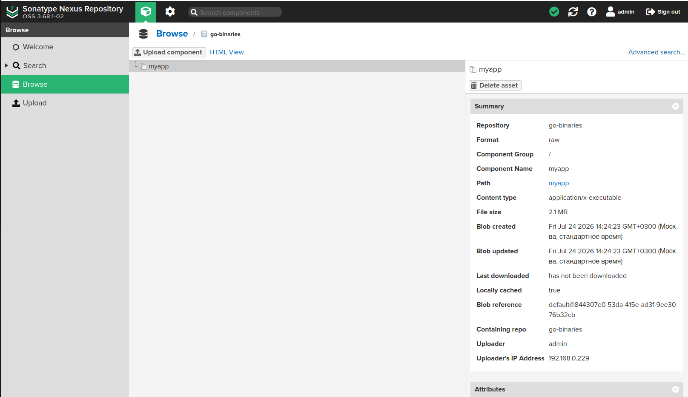

# Домашнее задание к занятию «Что такое DevOps. СI/СD». Студент: Демин Дмитрий .

## Задание 1

Что нужно сделать:

    Установите себе jenkins по инструкции из лекции или любым другим способом из официальной документации. Использовать Docker в этом задании нежелательно.
    Установите на машину с jenkins golang.
    Используя свой аккаунт на GitHub, сделайте себе форк репозитория. В этом же репозитории находится дополнительный материал для выполнения ДЗ.
    Создайте в jenkins Freestyle Project, подключите получившийся репозиторий к нему и произведите запуск тестов и сборку проекта go test . и docker build ..

В качестве ответа пришлите скриншоты с настройками проекта и результатами выполнения сборки.

### Решение

1. **Установка окружения**
   - Установлен Jenkins на ОС Ubuntu (без использования Docker-контейнера для самого Jenkins, согласно заданию).
   - На машине с Jenkins установлен Go (версия `go1.23.0`) и Docker (версия `29.6.1`).
   - Пользователь `jenkins` добавлен в группу `docker` для доступа к демону.

2. **Подготовка репозитория**
   - Выполнен форк репозитория `github.com/netology-code/sdvps-materials`
в личный аккаунт GitHub: `dmitrydemin1994-design/sdvps-materials`.
   - В репозитории содержатся: `main.go`, `main_test.go`, `Dockerfile`.

3. **Настройка Jenkins Freestyle Project**
   - Создан проект типа **Freestyle Project** с именем `my_pipe`.
   - **Source Code Management**: настроен Git с URL репозитория и веткой `main`.
   - **Build Triggers**: сборка запускается вручную (Build Now).
   - **Build → Execute Shell**: реализован единый скрипт, выполняющий последовательные этапы.

``` Text
export PATH=$PATH:/usr/local/go/bin
echo "=== 1. Проверка окружения ==="
which go; go version
which java; java -version
docker --version
echo "=== 2. Содержание директории ==="
ls -la
echo "=== 3. Тест  ==="
go test -v
echo "=== 4. Сборка Docker-образа ==="
docker build -t my-go-app:build-${BUILD_NUMBER} .
```

4. **Логика пайплайна (CI-этап)**
   - **Unit-тестирование**: запуск `go test -v ./...` для проверки корректности кода до сборки образа.
   - **Версионирование**: сборка Docker-образа с тегом вида `my-go-app:build-${BUILD_NUMBER}` на основе встроенной переменной Jenkins. Это обеспечивает воспроизводимость и возможность отката на конкретную сборку.

``` Text
Started by user Demin D. A.
Running as SYSTEM
Building in workspace /var/lib/jenkins/workspace/my_pipe
The recommended git tool is: NONE
No credentials specified
 > git rev-parse --resolve-git-dir /var/lib/jenkins/workspace/my_pipe/.git # timeout=10
Fetching changes from the remote Git repository
 > git config remote.origin.url
https://github.com/dmitrydemin1994-design/sdvps-materials.git # timeout=10
Fetching upstream changes from https://github.com/dmitrydemin1994-design/sdvps-materials.git
 > git --version # timeout=10
 > git --version # 'git version 2.43.0'
 > git fetch --tags --force --progress -- https://github.com/dmitrydemin1994-design/sdvps-materials.git +refs/heads/*:refs/remotes/origin/* # timeout=10
 > git rev-parse refs/remotes/origin/main^{commit} # timeout=10
Checking out Revision 223dbc3f489784448004e020f2ef224f17a7b06d (refs/remotes/origin/main)
 > git config core.sparsecheckout # timeout=10
 > git checkout -f 223dbc3f489784448004e020f2ef224f17a7b06d # timeout=10
Commit message: "Update README.md"
 > git rev-list --no-walk 223dbc3f489784448004e020f2ef224f17a7b06d # timeout=10
[my_pipe] $ /bin/sh -xe /tmp/jenkins16116048315871584564.sh
+ export PATH=/usr/local/sbin:/usr/local/bin:/usr/sbin:/usr/bin:/snap/bin:/usr/local/go/bin
+ echo === 1. Проверка окружения ===
=== 1. Проверка окружения ===
+ which go
/usr/local/go/bin/go
+ go version
go version go1.23.0 linux/amd64
+ which java
/usr/bin/java
+ java -version
openjdk version "21.0.11" 2026-04-21
OpenJDK Runtime Environment (build 21.0.11+10-1-24.04.2-Ubuntu)
OpenJDK 64-Bit Server VM (build 21.0.11+10-1-24.04.2-Ubuntu, mixed mode, sharing)
+ docker --version
Docker version 29.6.1, build 8900f1d
+ echo === 2. Содержание директории ===
=== 2. Содержание директории ===
+ ls -la
итого 48
drwxr-xr-x 5 jenkins jenkins 4096 июл 24 10:25 .
drwxr-xr-x 3 jenkins jenkins 4096 июл 24 10:25 ..
drwxr-xr-x 2 jenkins jenkins 4096 июл 24 10:25 CICD
-rw-r--r-- 1 jenkins jenkins  311 июл 24 10:25 Dockerfile
drwxr-xr-x 8 jenkins jenkins 4096 июл 24 10:37 .git
drwxr-xr-x 2 jenkins jenkins 4096 июл 24 10:25 gitlab
-rw-r--r-- 1 jenkins jenkins   57 июл 24 10:25 go.mod
-rw-r--r-- 1 jenkins jenkins  239 июл 24 10:25 main.go
-rw-r--r-- 1 jenkins jenkins  175 июл 24 10:25 main_test.go
-rw-r--r-- 1 jenkins jenkins  441 июл 24 10:25 README.md
-rw-r--r-- 1 jenkins jenkins 4460 июл 24 10:25 Vagrantfile
+ echo === 3. Тест  ===
=== 3. Тест  ===
+ go test -v
=== RUN   TestHello
--- PASS: TestHello (0.00s)
PASS
ok  	github.com/netology-code/sdvps-materials	0.003s
+ echo === 4. Сборка Docker-образа ===
=== 4. Сборка Docker-образа ===
+ docker build -t my-go-app:build-7 .
#0 building with "default" instance using docker driver

#1 [internal] load build definition from Dockerfile
#1 transferring dockerfile: 350B 0.0s done
#1 DONE 0.1s

#2 [internal] load metadata for docker.io/library/alpine:latest
#2 DONE 6.7s

#3 [internal] load metadata for docker.io/library/golang:1.16
#3 DONE 6.7s

#4 [internal] load .dockerignore
#4 transferring context: 2B done
#4 DONE 0.0s

#5 [internal] load build context
#5 DONE 0.0s

#6 [builder 1/4] FROM docker.io/library/golang:1.16@sha256:5f6a4662de3efc6d6bb812d02e9de3d8698eea16b8eb7281f03e6f3e8383018e
#6 resolve docker.io/library/golang:1.16@sha256:5f6a4662de3efc6d6bb812d02e9de3d8698eea16b8eb7281f03e6f3e8383018e 0.1s done
#6 DONE 0.1s

#7 [stage-1 1/3] FROM docker.io/library/alpine:latest@sha256:28bd5fe8b56d1bd048e5babf5b10710ebe0bae67db86916198a6eec434943f8b
#7 resolve docker.io/library/alpine:latest@sha256:28bd5fe8b56d1bd048e5babf5b10710ebe0bae67db86916198a6eec434943f8b 0.1s done
#7 DONE 0.1s

#5 [internal] load build context
#5 transferring context: 107.54kB 0.1s done
#5 DONE 0.1s

#8 [builder 2/4] WORKDIR /go/src/github.com/netology-code/sdvps-materials
#8 CACHED

#9 [builder 3/4] COPY . ./
#9 DONE 0.2s

#10 [builder 4/4] RUN CGO_ENABLED=0 GOOS=linux go build -a -installsuffix nocgo -o /app .
#10 DONE 5.9s

#11 [stage-1 2/3] RUN apk -U add ca-certificates
#11 CACHED

#12 [stage-1 3/3] COPY --from=builder /app /app
#12 CACHED

#13 exporting to image
#13 exporting layers done
#13 exporting manifest sha256:ac9ca46f73577dc1a5aa4043ea40e583e68d1fde993d6cdb3d7778fd91c1902d done
#13 exporting config sha256:0d75291e0369b8f789a2ecf5219a32c50200af9dae50aa305bf0159986ecc6a6 done
#13 exporting attestation manifest sha256:cdc192fcf676fd61f9f0712591abe0e9c20f9683bbcebf17fc9e0c015cdadb38 0.1s done
#13 exporting manifest list sha256:d858f19f3368d0c16f170cbb04b12e7021593a34794251855426b69a27a53c8d
#13 exporting manifest list sha256:d858f19f3368d0c16f170cbb04b12e7021593a34794251855426b69a27a53c8d 0.0s done
#13 naming to docker.io/library/my-go-app:build-7 done
#13 unpacking to docker.io/library/my-go-app:build-7 0.0s done
#13 DONE 0.2s
Finished: SUCCESS
```
## Задание 2

Что нужно сделать:

    Создайте новый проект pipeline.
    Перепишите сборку из задания 1 на declarative в виде кода.


## Решение

Для автоматизации сборки проекта настроен декларативный Jenkins Pipeline (Jenkinsfile), размещённый в репозитории.
Особенности реализации:

    1.Пайплайн использует подход GitOps: Jenkins берёт Jenkinsfile напрямую из GitHub.

    2.Учтена изолированность окружения CI‑агента: Go вызывается по абсолютному пути (/usr/local/go/bin/go), так как переменная PATH пользователя jenkins не содержит путь к Go.

    Стадии пайплайна: проверка окружения, вывод содержимого рабочей директории, запуск тестов (go test -v), сборка Docker‑образа.

### Jenkinsfile

```
pipeline {
    agent any

    environment {
        // Переменная для тега образа — чтобы не дублировать в нескольких местах
        IMAGE_TAG = "my-go-app:build-${BUILD_NUMBER}"
        GO_CMD = "/usr/local/go/bin/go"
    }

    stages {
        stage('Check Environment') {
            steps {
                echo '=== 1. Проверка окружения ==='
                sh '''
                    export PATH=$PATH:/usr/local/go/bin
                    which go
                    go version
                    which java
                    java -version
                    docker --version
                '''
            }
        }

        stage('List Directory') {
            steps {
                echo '=== 2. Содержание директории ==='
                sh 'ls -la'
            }
        }

        stage('Run Go Tests') {
            steps {
                echo '=== 3. Тест ==='
                sh '${GO_CMD} test -v'
            }
        }

        stage('Build Docker Image') {
            steps {
                echo "=== 4. Сборка Docker-образа: ${IMAGE_TAG} ==="
                sh "docker build -t ${IMAGE_TAG} ."
                }
        }
    }

    post {
        always {
            echo '=== Пайплайн завершён ==='
        }
        failure {
            echo '=== СБОЙ: пайплайн не прошёл ==='
        }
    }
}
```
### Запуск сборки.
``` Text
Started by user Demin D. A.
Obtained Jenkinsfile from git
https://github.com/dmitrydemin1994-design/sdvps-materials.git
[Pipeline] Start of Pipeline
[Pipeline] node
Running on Jenkins in /var/lib/jenkins/workspace/my_pipe2
[Pipeline] {
[Pipeline] stage
[Pipeline] { (Declarative: Checkout SCM)
[Pipeline] checkout
Selected Git installation does not exist. Using Default
The recommended git tool is: NONE
No credentials specified
 > git rev-parse --resolve-git-dir /var/lib/jenkins/workspace/my_pipe2/.git # timeout=10
Fetching changes from the remote Git repository
 > git config remote.origin.url https://github.com/dmitrydemin1994-design/sdvps-materials.git # timeout=10
Fetching upstream changes from https://github.com/dmitrydemin1994-design/sdvps-materials.git
 > git --version # timeout=10
 > git --version # 'git version 2.43.0'
 > git fetch --tags --force --progress -- https://github.com/dmitrydemin1994-design/sdvps-materials.git +refs/heads/*:refs/remotes/origin/* # timeout=10
 > git rev-parse refs/remotes/origin/main^{commit} # timeout=10
Checking out Revision 0a49c92f1136a49360c6b776108f61a1e9aa0297 (refs/remotes/origin/main)
 > git config core.sparsecheckout # timeout=10
 > git checkout -f 0a49c92f1136a49360c6b776108f61a1e9aa0297 # timeout=10
Commit message: "Исправлена 2 ошибка окружения  в Jenkinsfile"
 > git rev-list --no-walk 4179d8edb16e67af1458363cf674f936fd413edf # timeout=10
[Pipeline] }
[Pipeline] // stage
[Pipeline] withEnv
[Pipeline] {
[Pipeline] withEnv
[Pipeline] {
[Pipeline] stage
[Pipeline] { (Check Environment)
[Pipeline] echo
=== 1. Проверка окружения ===
[Pipeline] sh
+ export PATH=/usr/local/sbin:/usr/local/bin:/usr/sbin:/usr/bin:/snap/bin:/usr/local/go/bin
+ which go
/usr/local/go/bin/go
+ go version
go version go1.23.0 linux/amd64
+ which java
/usr/bin/java
+ java -version
openjdk version "21.0.11" 2026-04-21
OpenJDK Runtime Environment (build 21.0.11+10-1-24.04.2-Ubuntu)
OpenJDK 64-Bit Server VM (build 21.0.11+10-1-24.04.2-Ubuntu, mixed mode, sharing)
+ docker --version
Docker version 29.6.1, build 8900f1d
[Pipeline] }
[Pipeline] // stage
[Pipeline] stage
[Pipeline] { (List Directory)
[Pipeline] echo
=== 2. Содержание директории ===
[Pipeline] sh
+ ls -la
итого 52
drwxr-xr-x 5 jenkins jenkins 4096 июл 24 11:52 .
drwxr-xr-x 5 jenkins jenkins 4096 июл 24 11:41 ..
drwxr-xr-x 2 jenkins jenkins 4096 июл 24 11:41 CICD
-rw-r--r-- 1 jenkins jenkins  311 июл 24 11:41 Dockerfile
drwxr-xr-x 8 jenkins jenkins 4096 июл 24 11:52 .git
drwxr-xr-x 2 jenkins jenkins 4096 июл 24 11:41 gitlab
-rw-r--r-- 1 jenkins jenkins   57 июл 24 11:41 go.mod
-rw-r--r-- 1 jenkins jenkins 1487 июл 24 11:52 Jenkinsfile
-rw-r--r-- 1 jenkins jenkins  239 июл 24 11:41 main.go
-rw-r--r-- 1 jenkins jenkins  175 июл 24 11:41 main_test.go
-rw-r--r-- 1 jenkins jenkins  441 июл 24 11:41 README.md
-rw-r--r-- 1 jenkins jenkins 4460 июл 24 11:41 Vagrantfile
[Pipeline] }
[Pipeline] // stage
[Pipeline] stage
[Pipeline] { (Run Go Tests)
[Pipeline] echo
=== 3. Тест ===
[Pipeline] sh
+ /usr/local/go/bin/go test -v
=== RUN   TestHello
--- PASS: TestHello (0.00s)
PASS
ok  	github.com/netology-code/sdvps-materials	0.004s
[Pipeline] }
[Pipeline] // stage
[Pipeline] stage
[Pipeline] { (Build Docker Image)
[Pipeline] echo
=== 4. Сборка Docker-образа: my-go-app:build-5 ===
[Pipeline] sh
+ docker build -t my-go-app:build-5 .
#0 building with "default" instance using docker driver

#1 [internal] load build definition from Dockerfile
#1 transferring dockerfile: 350B 0.0s done
#1 DONE 0.1s

#2 [internal] load metadata for docker.io/library/golang:1.16
#2 ...

#3 [internal] load metadata for docker.io/library/alpine:latest
#3 DONE 1.8s

#2 [internal] load metadata for docker.io/library/golang:1.16
#2 DONE 1.8s

#4 [internal] load .dockerignore
#4 transferring context: 2B done
#4 DONE 0.1s

#5 [internal] load build context
#5 DONE 0.0s

#6 [stage-1 1/3] FROM docker.io/library/alpine:latest@sha256:28bd5fe8b56d1bd048e5babf5b10710ebe0bae67db86916198a6eec434943f8b
#6 resolve docker.io/library/alpine:latest@sha256:28bd5fe8b56d1bd048e5babf5b10710ebe0bae67db86916198a6eec434943f8b 0.1s done
#6 DONE 0.1s

#7 [builder 1/4] FROM docker.io/library/golang:1.16@sha256:5f6a4662de3efc6d6bb812d02e9de3d8698eea16b8eb7281f03e6f3e8383018e
#7 resolve docker.io/library/golang:1.16@sha256:5f6a4662de3efc6d6bb812d02e9de3d8698eea16b8eb7281f03e6f3e8383018e 0.1s done
#7 DONE 0.1s

#5 [internal] load build context
#5 transferring context: 88.83kB 0.0s done
#5 DONE 0.1s

#8 [builder 2/4] WORKDIR /go/src/github.com/netology-code/sdvps-materials
#8 CACHED

#9 [builder 3/4] COPY . ./
#9 DONE 0.1s

#10 [builder 4/4] RUN CGO_ENABLED=0 GOOS=linux go build -a -installsuffix nocgo -o /app .
#10 DONE 6.0s

#11 [stage-1 2/3] RUN apk -U add ca-certificates
#11 CACHED

#12 [stage-1 3/3] COPY --from=builder /app /app
#12 CACHED

#13 exporting to image
#13 exporting layers done
#13 exporting manifest sha256:ac9ca46f73577dc1a5aa4043ea40e583e68d1fde993d6cdb3d7778fd91c1902d done
#13 exporting config sha256:0d75291e0369b8f789a2ecf5219a32c50200af9dae50aa305bf0159986ecc6a6 done
#13 exporting attestation manifest sha256:8b248a2b7bdd5fbe5a4194b159d93d633d7c67feb4d13413e80f06e512d6c706 0.1s done
#13 exporting manifest list sha256:40345c22f837fef8f50ef24ace5f72f9c9f0277f731c4c27f6a861a7194eeac6
#13 exporting manifest list sha256:40345c22f837fef8f50ef24ace5f72f9c9f0277f731c4c27f6a861a7194eeac6 0.0s done
#13 naming to docker.io/library/my-go-app:build-5 done
#13 unpacking to docker.io/library/my-go-app:build-5 0.0s done
#13 DONE 0.2s
[Pipeline] }
[Pipeline] // stage
[Pipeline] stage
[Pipeline] { (Declarative: Post Actions)
[Pipeline] echo
=== Пайплайн завершён ===
[Pipeline] }
[Pipeline] // stage
[Pipeline] }
[Pipeline] // withEnv
[Pipeline] }
[Pipeline] // withEnv
[Pipeline] }
[Pipeline] // node
[Pipeline] End of Pipeline
Finished: SUCCESS
```
## Задание 3

Что нужно сделать:

    Установите на машину Nexus.
    Создайте raw-hosted репозиторий.
    Измените pipeline так, чтобы вместо Docker-образа собирался бинарный go-файл. Команду можно скопировать из Dockerfile.
    Загрузите файл в репозиторий с помощью jenkins.


## Решение

В рамках задания №3 настроен CI/CD-пайплайн в Jenkins:

    1. Установлен и настроен Nexus, создан raw-hosted репозиторий go-binaries.
    2. Пайплайн изменён: вместо сборки Docker-образа выполняется сборка статического Go‑бинарника (CGO_ENABLED=0, GOOS=linux). Команда сборки перенесена из Dockerfile.
    3. Артефакт загружается в Nexus через HTTP PUT (curl -T) с авторизацией.
    4. Учётные данные вынесены в Jenkins Credentials (ID: nexus-creds), хардкод секретов в коде не используется.
    5. Выполнены тесты (go test -v), сборка и загрузка прошли успешно. Анонимный доступ к Nexus отключён.»


### Jenkinsfile
``` Text
pipeline {
    agent any

    environment {
        // Переменная для тега образа — чтобы не дублировать в нескольких местах
        IMAGE_TAG = "my-go-app:build-${BUILD_NUMBER}"
        GO_CMD = "/usr/local/go/bin/go"
    }

    stages {
        stage('Check Environment') {
            steps {
                echo '=== 1. Проверка окружения ==='
                sh '''
                    export PATH=$PATH:/usr/local/go/bin
                    which go
                    go version
                    which java
                    java -version
                    docker --version
                '''
            }
        }

        stage('List Directory') {
            steps {
                echo '=== 2. Содержание директории ==='
                sh 'ls -la'
            }
        }

        stage('Run Go Tests') {
            steps {
                echo '=== 3. Тест ==='
                sh '${GO_CMD} test -v'
            }
        }

        stage('Build Go binary') {
            steps {
                sh '''
                    export PATH=$PATH:/usr/local/go/bin
                    export GOPATH=/tmp/go
                    mkdir -p $GOPATH
                    cd $WORKSPACE
                    CGO_ENABLED=0 GOOS=linux ${GO_CMD} build -a -installsuffix nocgo -o myapp .
                '''
            }
        }

        stage('Upload to Nexus') {
            environment {
                NEXUS_URL = 'http://192.168.0.229:8081/repository/go-binaries/'
            }
            steps {
                withCredentials([usernamePassword(
                    credentialsId: 'nexus-creds',
                    usernameVariable: 'NEXUS_USER',
                    passwordVariable: 'NEXUS_PASS'
                )]) {
                    sh '''
                        export PATH=$PATH:/usr/local/go/bin
                        curl -u "${NEXUS_USER}:${NEXUS_PASS}" \
                             -T myapp \
                             "${NEXUS_URL}myapp"
                    '''
                }
            }
        }

    }

    post {
        always {
            echo '=== Пайплайн завершён ==='
        }
        failure {
            echo '=== СБОЙ: пайплайн не прошёл ==='
        }
    }
}
```
### Запуск сборки

``` Text
Started by user Demin D. A.
Obtained Jenkinsfile from git
https://github.com/dmitrydemin1994-design/sdvps-materials.git
[Pipeline] Start of Pipeline
[Pipeline] node
Running on Jenkins in /var/lib/jenkins/workspace/my_pipe2
[Pipeline] {
[Pipeline] stage
[Pipeline] { (Declarative: Checkout SCM)
[Pipeline] checkout
Selected Git installation does not exist. Using Default
The recommended git tool is: NONE
No credentials specified
 > git rev-parse --resolve-git-dir /var/lib/jenkins/workspace/my_pipe2/.git # timeout=10
Fetching changes from the remote Git repository
 > git config remote.origin.url https://github.com/dmitrydemin1994-design/sdvps-materials.git # timeout=10
Fetching upstream changes from https://github.com/dmitrydemin1994-design/sdvps-materials.git
 > git --version # timeout=10
 > git --version # 'git version 2.43.0'
 > git fetch --tags --force --progress -- https://github.com/dmitrydemin1994-design/sdvps-materials.git +refs/heads/*:refs/remotes/origin/* # timeout=10
 > git rev-parse refs/remotes/origin/main^{commit} # timeout=10
Checking out Revision 7b0cfd0f1c8dd87b9110c1116e4379d138eaf323 (refs/remotes/origin/main)
 > git config core.sparsecheckout # timeout=10
 > git checkout -f 7b0cfd0f1c8dd87b9110c1116e4379d138eaf323 # timeout=10
Commit message: "Исправлена ошибка 2 в Jenkinsfile"
 > git rev-list --no-walk 112b4018343deedc0a862901b168464418502b5a # timeout=10
[Pipeline] }
[Pipeline] // stage
[Pipeline] withEnv
[Pipeline] {
[Pipeline] withEnv
[Pipeline] {
[Pipeline] stage
[Pipeline] { (Check Environment)
[Pipeline] echo
=== 1. Проверка окружения ===
[Pipeline] sh
+ export PATH=/usr/local/sbin:/usr/local/bin:/usr/sbin:/usr/bin:/snap/bin:/usr/local/go/bin
+ which go
/usr/local/go/bin/go
+ go version
go version go1.23.0 linux/amd64
+ which java
/usr/bin/java
+ java -version
openjdk version "21.0.11" 2026-04-21
OpenJDK Runtime Environment (build 21.0.11+10-1-24.04.2-Ubuntu)
OpenJDK 64-Bit Server VM (build 21.0.11+10-1-24.04.2-Ubuntu, mixed mode, sharing)
+ docker --version
Docker version 29.6.1, build 8900f1d
[Pipeline] }
[Pipeline] // stage
[Pipeline] stage
[Pipeline] { (List Directory)
[Pipeline] echo
=== 2. Содержание директории ===
[Pipeline] sh
+ ls -la
итого 52
drwxr-xr-x 5 jenkins jenkins 4096 июл 24 14:24 .
drwxr-xr-x 5 jenkins jenkins 4096 июл 24 11:41 ..
drwxr-xr-x 2 jenkins jenkins 4096 июл 24 11:41 CICD
-rw-r--r-- 1 jenkins jenkins  311 июл 24 11:41 Dockerfile
drwxr-xr-x 8 jenkins jenkins 4096 июл 24 14:24 .git
drwxr-xr-x 2 jenkins jenkins 4096 июл 24 11:41 gitlab
-rw-r--r-- 1 jenkins jenkins   57 июл 24 11:41 go.mod
-rw-r--r-- 1 jenkins jenkins 2364 июл 24 14:24 Jenkinsfile
-rw-r--r-- 1 jenkins jenkins  239 июл 24 11:41 main.go
-rw-r--r-- 1 jenkins jenkins  175 июл 24 11:41 main_test.go
-rw-r--r-- 1 jenkins jenkins  441 июл 24 11:41 README.md
-rw-r--r-- 1 jenkins jenkins 4460 июл 24 11:41 Vagrantfile
[Pipeline] }
[Pipeline] // stage
[Pipeline] stage
[Pipeline] { (Run Go Tests)
[Pipeline] echo
=== 3. Тест ===
[Pipeline] sh
+ /usr/local/go/bin/go test -v
=== RUN   TestHello
--- PASS: TestHello (0.00s)
PASS
ok  	github.com/netology-code/sdvps-materials	0.004s
[Pipeline] }
[Pipeline] // stage
[Pipeline] stage
[Pipeline] { (Build Go binary)
[Pipeline] sh
+ export PATH=/usr/local/sbin:/usr/local/bin:/usr/sbin:/usr/bin:/snap/bin:/usr/local/go/bin
+ export GOPATH=/tmp/go
+ mkdir -p /tmp/go
+ cd /var/lib/jenkins/workspace/my_pipe2
+ CGO_ENABLED=0 GOOS=linux /usr/local/go/bin/go build -a -installsuffix nocgo -o myapp .
[Pipeline] }
[Pipeline] // stage
[Pipeline] stage
[Pipeline] { (Upload to Nexus)
[Pipeline] withEnv
[Pipeline] {
[Pipeline] withCredentials
Masking supported pattern matches of $NEXUS_PASS
[Pipeline] {
[Pipeline] sh
+ export PATH=/usr/local/sbin:/usr/local/bin:/usr/sbin:/usr/bin:/snap/bin:/usr/local/go/bin
+ curl -u admin:**** -T myapp http://192.168.0.229:8081/repository/go-binaries/myapp
  % Total    % Received % Xferd  Average Speed   Time    Time     Time  Current
                                 Dload  Upload   Total   Spent    Left  Speed

  0     0    0     0    0     0      0      0 --:--:-- --:--:-- --:--:--     0
100 2184k    0     0  100 2184k      0  5651k --:--:-- --:--:-- --:--:-- 5645k
100 2184k    0     0  100 2184k      0  5649k --:--:-- --:--:-- --:--:-- 5645k
[Pipeline] }
[Pipeline] // withCredentials
[Pipeline] }
[Pipeline] // withEnv
[Pipeline] }
[Pipeline] // stage
[Pipeline] stage
[Pipeline] { (Declarative: Post Actions)
[Pipeline] echo
=== Пайплайн завершён ===
[Pipeline] }
[Pipeline] // stage
[Pipeline] }
[Pipeline] // withEnv
[Pipeline] }
[Pipeline] // withEnv
[Pipeline] }
[Pipeline] // node
[Pipeline] End of Pipeline
Finished: SUCCESS
```
