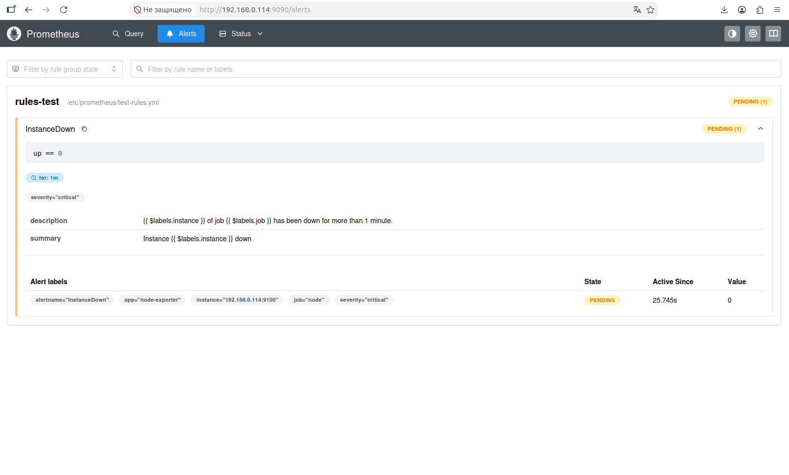
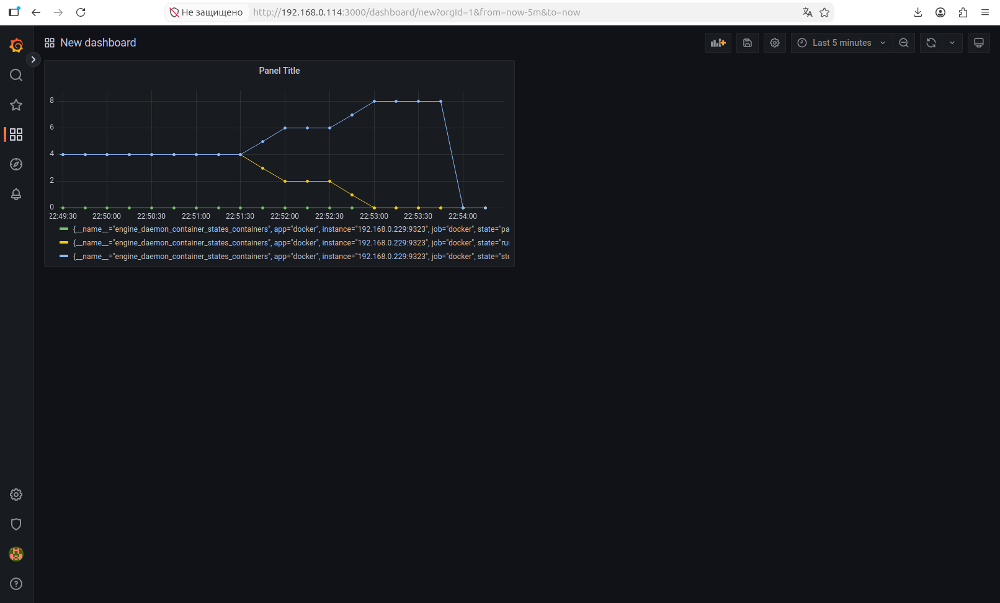

# Домашнее задание к занятию «Prometheus. Часть 2»

### Цели задания
1. Научитья настраивать оповещения в Prometheus
2. Научиться устанавливать Alertmanager и интегрировать его с Prometheus
3. Научиться активировать экспортёр метрик в Docker и подключать его к Prometheus.
4. Научиться создавать дашборд Grafana

---

### Задание 1
Создайте файл с правилом оповещения, как в лекции, и добавьте его в конфиг Prometheus.

### Требования к результату
- [X] Погасите node exporter, стоящий на мониторинге, и прикрепите скриншот раздела оповещений Prometheus, где оповещение будет в статусе Pending

#### Результат

---

### Задание 2
Установите Alertmanager и интегрируйте его с Prometheus.

### Требования к результату
- [X] Прикрепите скриншот Alerts из Prometheus, где правило оповещения будет в статусе Fireing, и скриншот из Alertmanager, где будет видно действующее правило оповещения

#### Результат

.png)
.png)

---

### Задание 3

Активируйте экспортёр метрик в Docker и подключите его к Prometheus.

### Требования к результату
- [X] приложите скриншот браузера с открытым эндпоинтом, а также скриншот списка таргетов из интерфейса Prometheus.*

#### Результат

.png)
.png)

---

### Задание 4* (со звездочкой)

Создайте свой дашборд Grafana с различными метриками Docker и сервера, на котором он стоит.

#### Результат

---