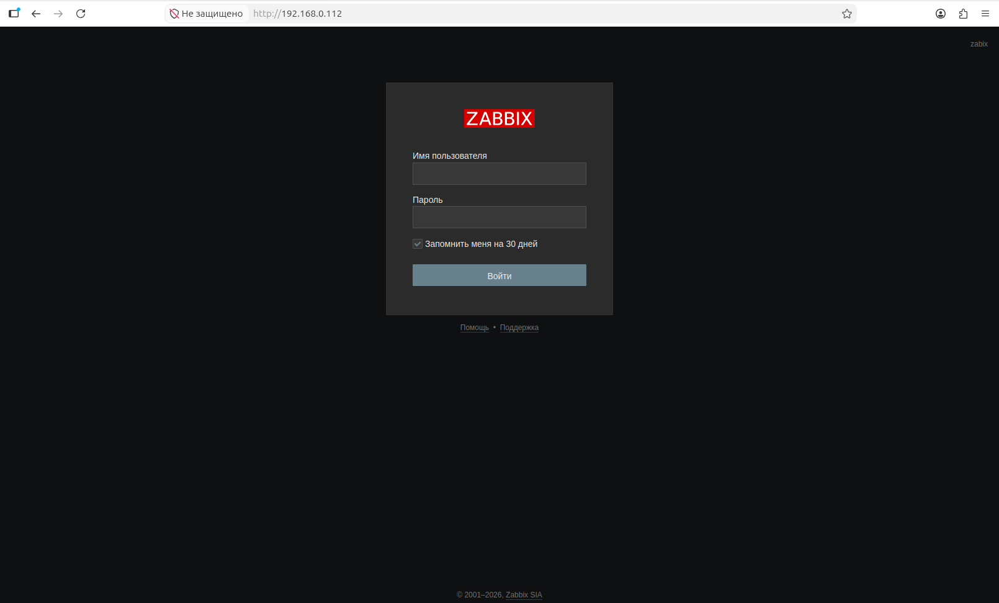
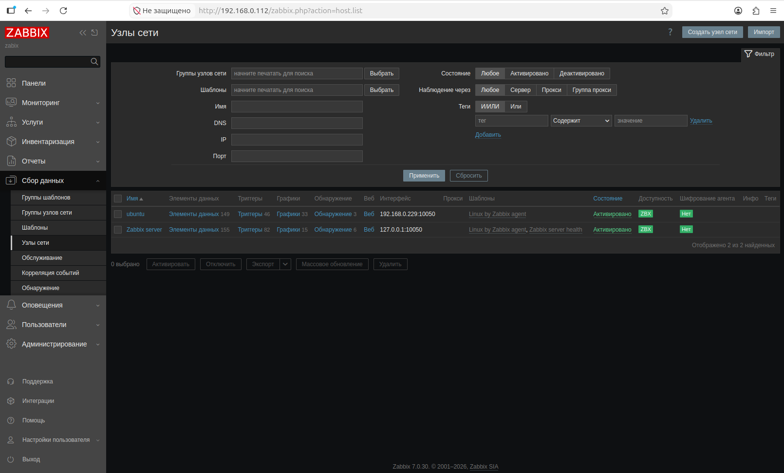
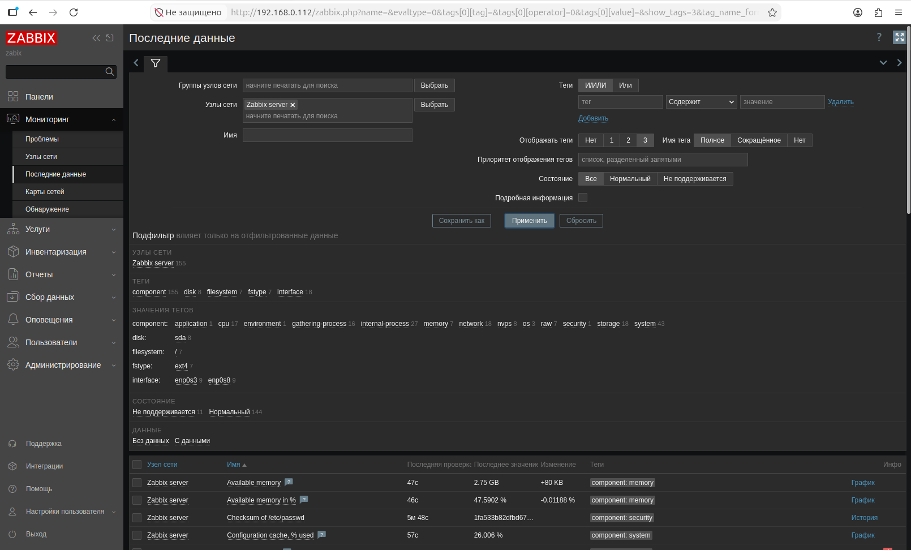
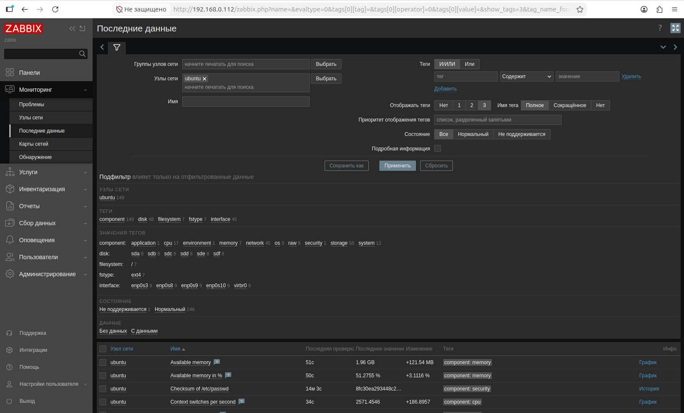

# Практическое задание с самопроверкой «Система мониторинга Zabbix»

## Задание 1
Установите Zabbix Server с веб-интерфейсом.

### Процесс выполнения
#### 1. Установите PostgreSQL.
##### Установка
``` bash
sudo apt update
sudo apt install postgresql postgresql-contrib
```
##### Базовые проверки
``` bash
systemctl status postgresql
psql --version
```
#### 2. Пользуясь конфигуратором команд с официального сайта, составьте набор команд для установки последней версии Zabbix с поддержкой PostgreSQL.
##### Полчаем права root
``` bash
sudo -s
```
##### Устанавливаем репозиторий Zabbix
``` bash
wget https://repo.zabbix.com/zabbix/7.0/ubuntu/pool/main/z/zabbix-release/zabbix-release_latest_7.0+ubuntu24.04_all.deb
dpkg -i zabbix-release_latest_7.0+ubuntu24.04_all.deb
apt update
```
##### Устанавливаем Zabbix сервер, веб-интерфейс и агент
``` bash
apt install zabbix-server-pgsql zabbix-frontend-php php8.3-pgsql zabbix-apache-conf zabbix-sql-scripts zabbix-agent
```
##### Создаём базу данных
``` bash
sudo -u postgres createuser --pwprompt zabbix
sudo -u postgres createdb -O zabbix zabbix
zcat /usr/share/zabbix-sql-scripts/postgresql/server.sql.gz | sudo -u zabbix psql zabbix
```
##### Отредактируем файл /etc/zabbix/zabbix_server.conf
``` text
DBPassword=password # Заменить на пароль заданный в предидущем шаге.
```
##### Запускаем процессы Zabbix сервера и агента
``` bash
systemctl restart zabbix-server zabbix-agent apache2
systemctl enable zabbix-server zabbix-agent apache2
```
##### Переходим к web-интерфейсу  http://localhost/zabbix



## Задание 2
Установите Zabbix Agent на два хоста.

### Процесс выполнения

#### 1. Установите Zabbix Agent на 2 вирт.машины, одной из них может быть ваш Zabbix Server.

##### Устанавливаем Zabbix Agent на 2й  Host

##### Полчаем права root
``` bash
sudo -s
```
##### Устанавливаем репозиторий Zabbix
``` bash
wget https://repo.zabbix.com/zabbix/7.0/ubuntu/pool/main/z/zabbix-release/zabbix-release_latest_7.0+ubuntu24.04_all.deb
dpkg -i zabbix-release_latest_7.0+ubuntu24.04_all.deb
apt update
```
##### Устанавливаем Zabbix агент
``` bash
apt install zabbix-agent
```
##### Запускаем процесс Zabbix агент
``` bash
systemctl restart zabbix-agent
systemctl enable zabbix-agent
```

#### 2. Добавьте Zabbix Server в список разрешенных серверов ваших Zabbix Agentов

##### Открываем файл /etc/zabbix/zabbix_agentd.conf и меняем парамертры
``` text
Server=<IP_Zabbix_Server>
ServerActive=<IP_Zabbix_Server>
```

#### 3. Добавьте Zabbix Agentов в раздел Configuration > Hosts вашего Zabbix Servera



#### 4. Проверьте, что в разделе Latest Data начали появляться данные с добавленных агентов.


