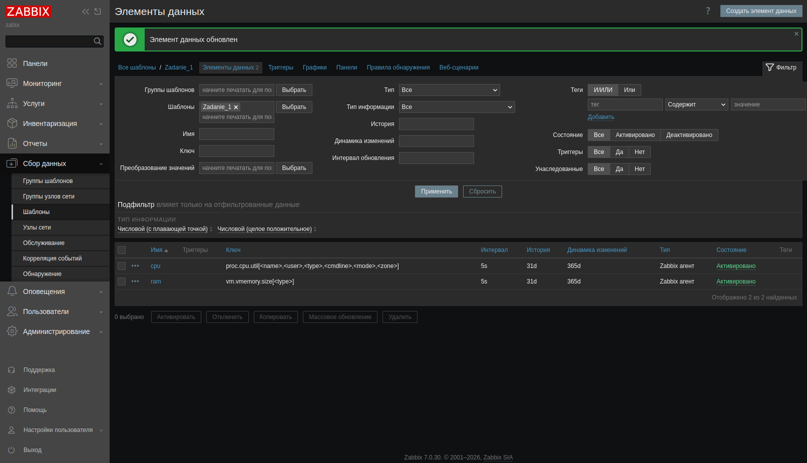
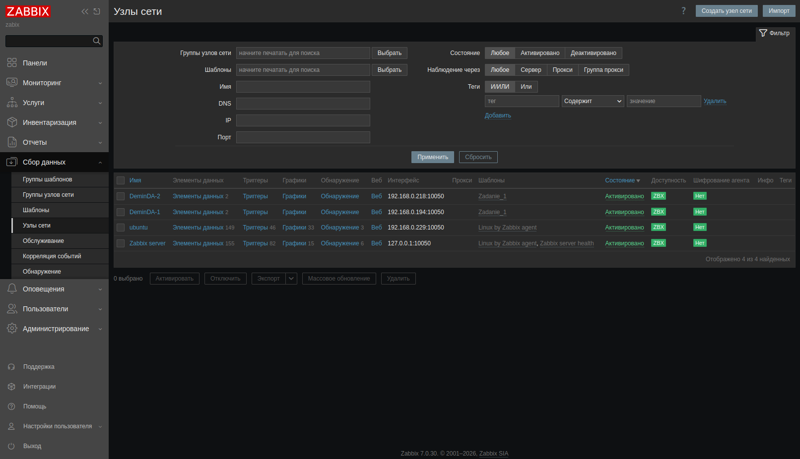
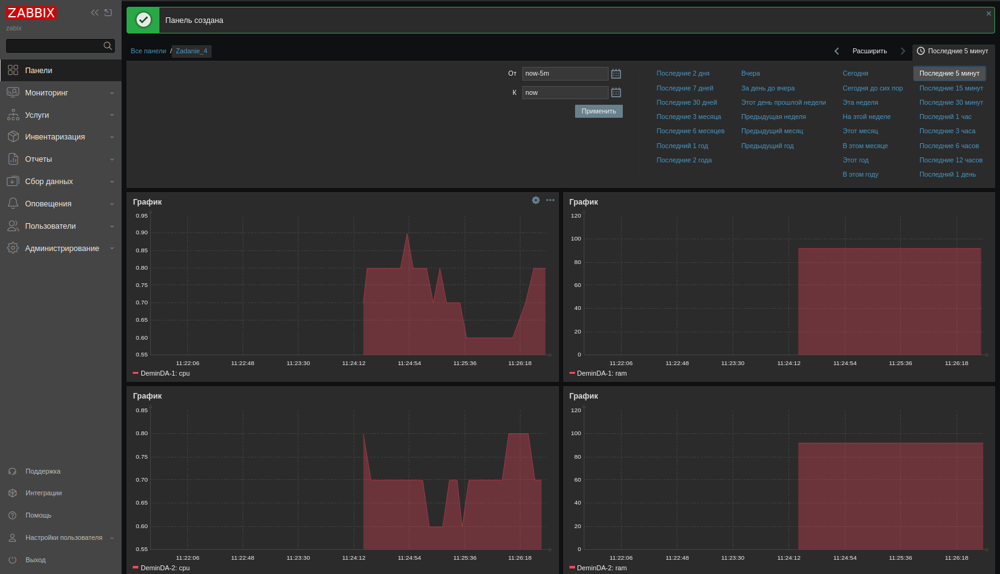
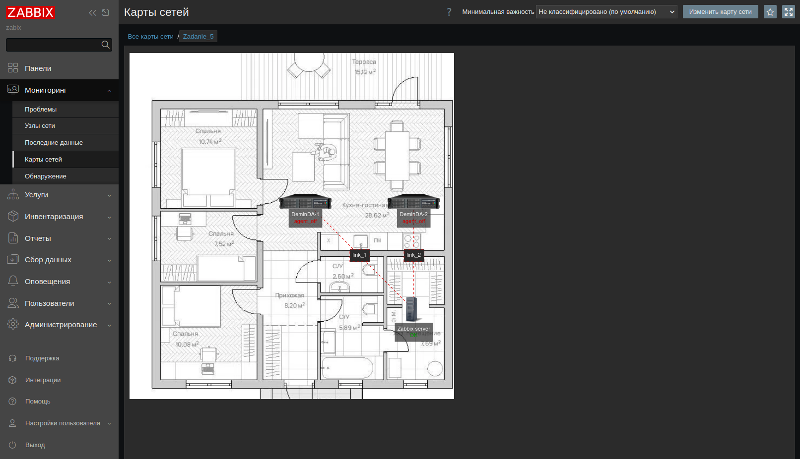
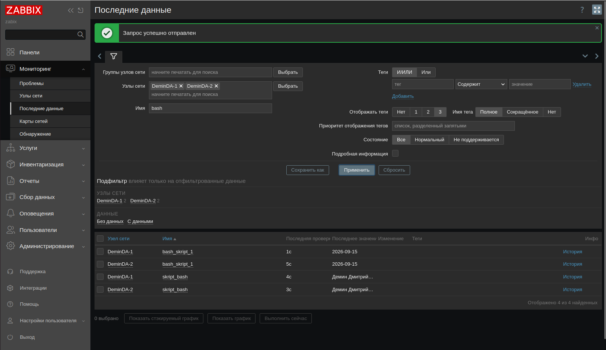
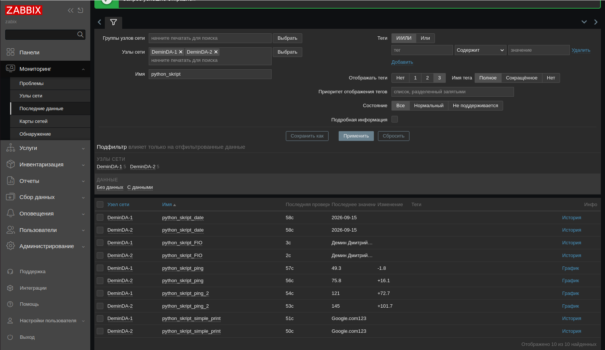

# Домашнее задание к занятию «Система мониторинга Zabbix. Часть 2»

## Задание 1

Создайте свой шаблон, в котором будут элементы данных, мониторящие загрузку CPU и RAM хоста. В качестве основы можно использовать шаблон Linux by Zabbix agent

### Процесс выполнения

   1. Выполняя ДЗ сверяйтесь с процессом отражённым в записи лекции.
   2. В веб-интерфейсе Zabbix Servera в разделе Templates создайте новый шаблон
   3. Создайте Item который будет собирать информацию об загрузке CPU в процентах
   4. Создайте Item который будет собирать информацию об загрузке RAM в процентах

### Требования к результату

    Прикрепите в файл README.md скриншот страницы шаблона с названием «Задание 1» (Zadanie_1)

### Результат



## Задание 2

Добавьте в Zabbix два хоста и задайте им имена <фамилия и инициалы-1> и <фамилия и инициалы-2>. Например:
```
ivanovii-1
ivanovii-2
```
### Процесс выполнения

   1. Выполняя ДЗ сверяйтесь с процессом отражённым в записи лекции.
   2. Установите Zabbix Agent на 2 виртмашины (одной из них может быть ваш Zabbix Server).
   3. Добавьте Zabbix Serve в список разрешенных серверов ваших Zabbix Agentов.
   4. Добавьте Zabbix Agentов в раздел Configuration -> Hosts вашего Zabbix Servera.

### Требования к результату

    Результат данного задания сдавайте вместе с Заданием 3

## Задание 3

Привяжите созданный ранее шаблон к двум хостам.
### роцесс выполнения

   1. Выполняя ДЗ сверяйтесь с процессом отражённым в записи лекции.
   2. Зайдите в настройки каждого хоста и в разделе Templates прикрепите к этому хосту ваш шаблон из первого задания.
   3. Проверьте что начали поступать необходимые данные из вашего шаблона в раздел Latest Data.

### Требования к результату

    Прикрепите в файл README.md скриншот страницы хостов, где будет видна привязка шаблона «Задание 1». Хосты должны иметь зелёный статус подключения.

### Результат



## Задание 4

Создайте свой кастомный дашбор для метрик вашего шаблона.
### Процесс выполнения

   1. Выполняя ДЗ сверяйтесь с процессом отражённым в записи лекции.
   2. В разделе Dashboards создайте новый дашборд
   3. Разместите на нём несколько графиков на ваше усмотрение.

### Требования к результату

   Прикрепите в файл README.md скриншот дашборда с названием «Задание 4» где отображаются графики загрузки CPU и RAM в процентах.

### Результат



## Задание 5* со звёздочкой

Создайте карту и расположите на ней два своих хоста.
### Процесс выполнения

   1. Настройте между хостами линк.
   2. Привяжите к линку триггер, связанный с agent.ping одного из хостов, и установите индикатором сработавшего триггера красную пунктирную линию.
   3. Выключите хост, чей триггер добавлен в линк. Дождитесь срабатывания триггера.

### Требования к результату

    Прикрепите в файл README.md скриншот карты, где видно, что триггер сработал, с названием «Задание 5»

### Результат



## Задание 6* со звёздочкой

Создайте UserParameter на bash и прикрепите его к созданному вами ранее шаблону. Он должен вызывать скрипт, который:

   1. при получении 1 будет возвращать ваши ФИО,
   2. при получении 2 будет возвращать текущую дату.

### Требования к результату

    Прикрепите в файл README.md код скрипта, а также скриншот Latest data с результатом работы скрипта на bash, чтобы был виден результат работы скрипта при отправке в него 1 и 2

### Результат

``` bash
!/usr/bin/env bash

case "$1" in
  "1")
    echo "Демин Дмитрий Александрович"
    ;;
  "2")
    date +"%Y-%m-%d"
    ;;
esac
```



## Задание 7* со звёздочкой

Доработайте Python-скрипт из лекции, создайте для него UserParameter и прикрепите его к созданному вами ранее шаблону. Скрипт должен:

   1. при получении 1 возвращать ваши ФИО.
   2. при получении 2 возвращать текущую дату.
   3. делать всё, что делал скрипт из лекции.

### Требования к результату

    Прикрепите в файл README.md код скрипта в Git. Приложите в Git скриншот Latest data с результатом работы скрипта на Python, чтобы были видны результаты работы скрипта при отправке в него 1, 2, -ping, а также -simple_print.*

### Результат

``` py
import sys
import os
import re
from datetime import date

if (sys.argv[1] == '-ping'): # Если -ping
    result=os.popen("ping -c 1 " + sys.argv[2]).read() # Делаем пинг по заданному адресу
    result=re.findall(r"time=(.*) ms", result) # Выдёргиваем из результата время
    print(result[0]) # Выводим результат в консоль

elif (sys.argv[1] == '-simple_print'): # Если simple_print
    print(sys.argv[2]) # Выводим в консоль содержимое sys.arvg[2]

elif (sys.argv[1] == '1'): # Если 1
    print("Демин Дмитрий Александрович") # Выводим в консоль "ФИО"

elif (sys.argv[1] == '2'): # Если 2
    print(date.today().isoformat()) # Выводим в консоль "Текущую дату"

else: # Во всех остальных случаях
    print(f"unknown input: {sys.argv[1]}") # Выводим непонятый запрос в консоль

```



## Задание 8* со звёздочкой

Настройте автообнаружение и прикрепление к хостам созданного вами ранее шаблона.
### Требования к результату

    Прикрепите в файл README.md скриншот правила обнаружения, а также скриншот страницы Discover, где видны оба хоста.*

### Результат

.png)
.png)
.png)
.png)